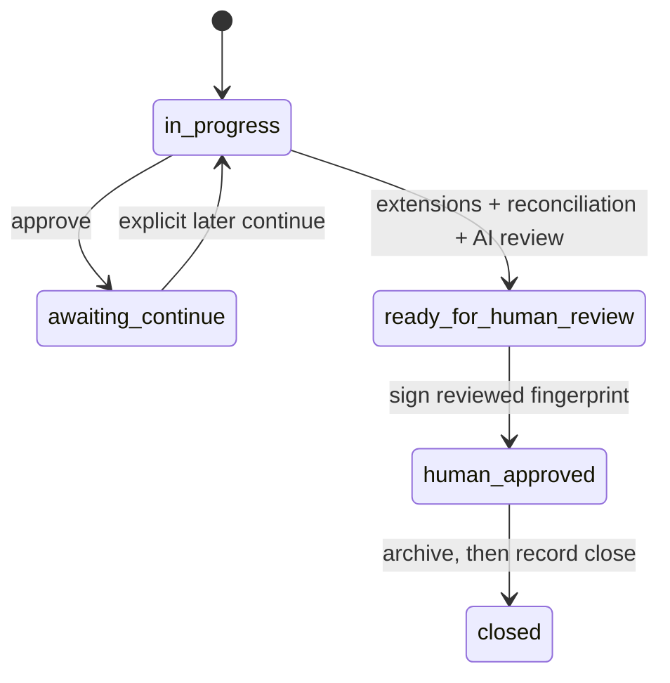
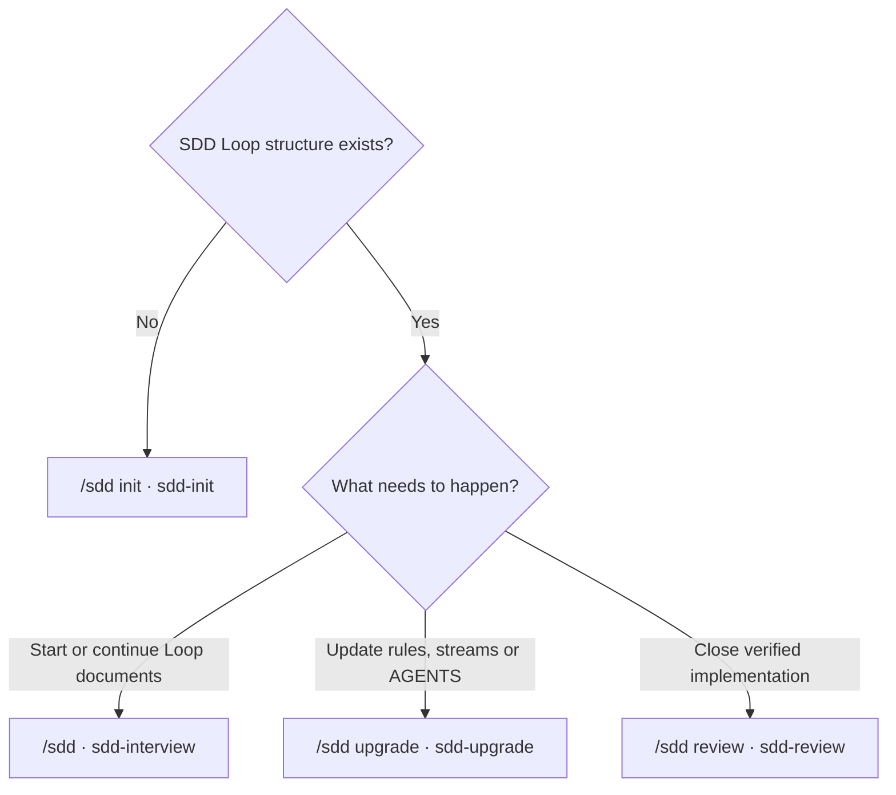

<h1 align="center">sdd-loop</h1>

<p align="center">
  <strong>A repeatable, auditable SDD lifecycle for AI-assisted delivery</strong>
</p>

<p align="center">
  <a href="LICENSE"></a>
  = 20">
  
</p>

<p align="center">
  <a href="#workflow">Workflow</a> &bull;
  <a href="#installation">Installation</a> &bull;
  <a href="#commands">Commands</a> &bull;
  <a href="#repository-layout">Layout</a>
</p>

<p align="center">
  <a href="README.md">English</a> &bull;
  <a href="README_zh.md">简体中文</a>
</p>

---

One request → 7-station interview → staged approval → isolated implementation → engineering verification → architecture reconciliation → AI review → human approval. One complete pass is a **Loop**.

## Workflow


The six stage documents and existing `nextPhase` values remain unchanged. The additional nodes are gates:

| Gate | Required evidence |
|---|---|
| Requirements | `requirements.md` is explicitly confirmed |
| Architecture/Baseline | Loop-local `architecture.md` is confirmed and the long-lived Architecture Baseline reflects current system facts |
| Specification | `specification.md` defines verifiable behavior |
| Tasks | `tasks.md` traces each task to confirmed clauses |
| Worktree Ready | In split repos, this stream + Loop has its own branch and Git worktree |
| Implementation | `implementation.md` records base branch, base commit, current branch and task scope |
| Automated Verification | Tests, builds, deployment checks and skipped items are recorded |
| Architecture Reconciliation | Final code is reflected in the Architecture Baseline and change surface |
| AI Review | A read-only reviewer returns one fixed verdict |
| Human Review | A person explicitly approves the reviewed fingerprint |
| Closed | Stage documents are archived and the status file is updated in the same change |

### Approval, roles and audit



| Mechanism | Rule |
|---|---|
| Roles | Requester, Product, Architect, Implementer, Reviewer and Approver map to Git emails |
| Approve | Confirms the current stage and enters `awaiting-continue`; it does not advance `nextPhase` |
| Continue | Must come from a later user message and revalidates role and document fingerprint |
| Audit | Each worktree appends to its own `audit/*.jsonl` shard; a hash chain detects rewriting |
| Privacy | Tokens, passwords and private keys are redacted; local worktree paths and full AI output are not stored |
| Invalidation | Document changes invalidate approval; code or critical-document changes invalidate review and signing |

### Engineering quality extensions

All four are enabled by default. Every Loop records `PASS`, `FAIL` or a reasoned `N/A`:

| Extension | Use it for | PASS evidence |
|---|---|---|
| Testing | Every change with executable behavior | Acceptance mapping, commands, exit codes, results and uncovered areas |
| PBT | Parsers, business rules, state machines, authorization, idempotency, ordering, pagination and concurrency | Property, input domain, case count, seed and regression counterexamples |
| Security | Changes to input, identity, authorization, tenancy, secrets, dependencies or network boundaries | Trust boundaries, negative tests, checks and residual risk |
| Resiliency | External dependencies, retry, transactions, deployment or runtime behavior | Failure scenarios, timeout/retry/idempotency, rollback and observability evidence |

Without a PBT library use: `existing library → existing test framework + deterministic seeded generator → approved new dependency`. A missing library is not an `N/A` reason; `N/A` is valid only when no valuable invariant exists.

### Worktree isolation

- Split repos use one branch and worktree per `stream + Loop`.
- The main checkout is only for synchronization, integration and review.
- Cross-system/platform changes use their own platform worktree.
- A Loop already implementing in the main checkout may record a one-time exemption; the next Loop cannot inherit it.

### Architecture and review

- Loop-local `architecture.md` describes this round's design. `docs/architecture/` describes the system as it exists now.
- Reuse an existing architecture layout. Otherwise use `docs/architecture/overview.md` for one system or `docs/architecture/<stream>.md` for split repos. Diagrams use Mermaid or ASCII.
- After automated verification, update the Architecture Baseline from final code and list the code, configuration, data, API, deployment, test and documentation change surface.
- Then run an independent, read-only AI review. Its only valid verdicts are `READY_FOR_HUMAN_REVIEW`, `CHANGES_REQUIRED` and `NOT_REVIEWABLE_SAFELY`.
- `verification.md` contains `Automated Verification`, `Architecture Reconciliation & Change Surface`, `AI Code Review` and `Human Review Packet`.
- Any code or critical-document change invalidates the old review. A Loop closes only after a human records approver, time, reviewed version and fingerprint.

## AGENTS.md handling

- Without an existing AGENTS.md, sdd-init selects the applicable single/split-project rules and writes the final structured file directly.
- With an existing AGENTS.md, sdd-init or sdd-upgrade writes `AGENTS.candidate.md` and an itemized report under `/tmp`; it never silently overwrites the repository file.
- Deletion, movement and merging require item-by-item approval. Model, permission, MCP and host configuration are out of scope.

Classifications: `KEEP_SDD_CANONICAL`, `KEEP_PROJECT_SPECIFIC`, `DUPLICATED`, `STALE`, `MODEL_OR_HOST_SPECIFIC`, `BELONGS_IN_AGENT_CONFIG`, `CANONICAL_ELSEWHERE`, `UNCLEAR`.

Audit verdicts: `RECOMMEND_ADOPTION`, `NEEDS_REVISION`, `KEEP_CURRENT`, `NOT_TESTABLE_SAFELY`.

## Installation

Requires Node ≥ 20.

**Full: four Skills + `capabilities` / `check` / `guide` CLI**

```bash
git clone https://github.com/Roger0808/sdd-loop.git && cd sdd-loop
npm install
npm link
sdd-loop init -g
```

**Skills only, when the CLI is already installed**

```bash
npx skills@latest add Roger0808/sdd-loop -g
```

| Target | Installation |
|---|---|
| Packaged Skills | [sdd-init](skills/sdd-init), [sdd-interview](skills/sdd-interview), [sdd-upgrade](skills/sdd-upgrade), [sdd-review](skills/sdd-review) |
| Claude Code | `~/.claude/skills/` |
| Agent Skills hosts | `~/.agents/skills/` — Codex, Gemini CLI, GitHub Copilot, Cursor, Windsurf, OpenCode, OpenClaw, Kimi Code, Antigravity, Factory Droid, Roo Code |
| Hermes Agent | registered through its skills configuration |
| pi | package registration |

| Option | Effect |
|---|---|
| `--claude` / `--agents` / `--openclaw` / `--hermes` / `--pi` | Limit installation to selected targets |
| `--show` | Preview without writing |
| OpenClaw default state | `sdd-loop init -g --openclaw` → `~/.agents/skills/` |
| Custom `OPENCLAW_STATE_DIR` | `sdd-loop init -g --openclaw` → `$OPENCLAW_STATE_DIR/skills/` |
| Existing file or directory | Report conflict; never overwrite or delete |

### Update

**Full installation**

```bash
cd <sdd-loop-dir>
git pull --ff-only
npm install
npm link
sdd-loop init -g
```

**Skills-only installation**

```bash
npx skills@latest update -g
```

| Update | Effect |
|---|---|
| `git pull` | Updates the CLI and symlinked Skill contents |
| `sdd-loop init -g` | Adds newly packaged Skills or host configuration |
| `npx skills@latest update -g` | Updates installations managed by `npx skills` |
| `sdd-upgrade` | Updates SDD/AGENTS rules inside a project; not the installed package |

Restart the host or open a new session after installation.

```bash
sdd-loop capabilities --require governance@1 --host agents
```

Run this before working in a governance-enabled repository. Set `--host` to `claude`, `agents`, `openclaw`, `hermes`, or `pi`; Codex, Kimi Code, and other shared Agent Skills hosts use `agents`. A missing command or non-zero exit means the CLI/rule resources are incomplete or Skills are not installed for that host. Project rules never auto-update tools.

## Commands

| CLI | Purpose |
|---|---|
| `sdd-loop capabilities --require governance@1 --host <host>` | Fail-closed check that the CLI, governance resources and host Skill installation support protocol 1 |
| `sdd-loop check` | Reconcile status declarations with repository facts |
| `sdd-loop guide --type <doc.clause>` | Show clause guidance and existing ID families |

### Four workflow commands



| pi command | Skill name / slash alias | Use it when | Result |
|---|---|---|---|
| `/sdd init` | `sdd-init` / `/sdd-init` | A repository has no SDD Loop structure | Creates the repository rules and initial status; does not write product content |
| `/sdd` | `sdd-interview` / `/sdd-interview` | Starting a product or a new Loop | Interviews and produces `requirements.md`, `architecture.md`, `specification.md` and `tasks.md` |
| `/sdd upgrade` | `sdd-upgrade` / `/sdd-upgrade` | An initialized repository needs current gates, governance roles, split-stream migration or AGENTS audit | Upgrades existing SDD conventions without inventing history or silently replacing project rules |
| `/sdd review` | `sdd-review` / `/sdd-review` | Implementation and automated verification are complete | Reconciles architecture, records change surface, runs AI review and prepares human review |

pi uses the first column; other hosts invoke the Skill name or slash alias.

### Status reconciliation

```bash
sdd-loop check
sdd-loop check --repo <dir>
sdd-loop check --stream <name>
sdd-loop check --json
```

| Exit | Meaning |
|---|---|
| `0` | clean |
| `1` | declarations contradict repository facts |
| `2` | evidence is unreadable; no verdict |

Repositories with `governanceVersion: 1` also validate approval/Continue, role identity, the audit hash chain, fingerprints, all four engineering extensions and the human close gate. Legacy repositories retain their existing results and exit codes.

### Clause guide

```bash
sdd-loop guide
sdd-loop guide --type specification.entity-table
```

It returns the required fields, existing ID families and a repository example before a clause is written. Unknown pi `/sdd` subcommands return usage.

## Repository layout

```text
your-project/
├── AGENTS.md
├── CLAUDE.md
└── docs/
    ├── architecture/
    │   └── overview.md or <stream>.md
    ├── loops/
    │   └── [<stream>/]
    │       ├── status.md
    │       └── loop-N/
    │           ├── audit/
    │           │   └── <writer-id>.jsonl
    │           ├── requirements.md
    │           ├── architecture.md
    │           ├── specification.md
    │           ├── tasks.md
    │           ├── implementation.md
    │           └── verification.md
    ├── sdd/extensions/        # optional project extensions; *.opt-in.md controls enablement
    └── archive/
```

`sdd-loop check` discovers single-stream and split-stream layouts automatically. Custom paths use `--status-file` and `--archive-dir`.

## License

MIT License — see [LICENSE](LICENSE).
