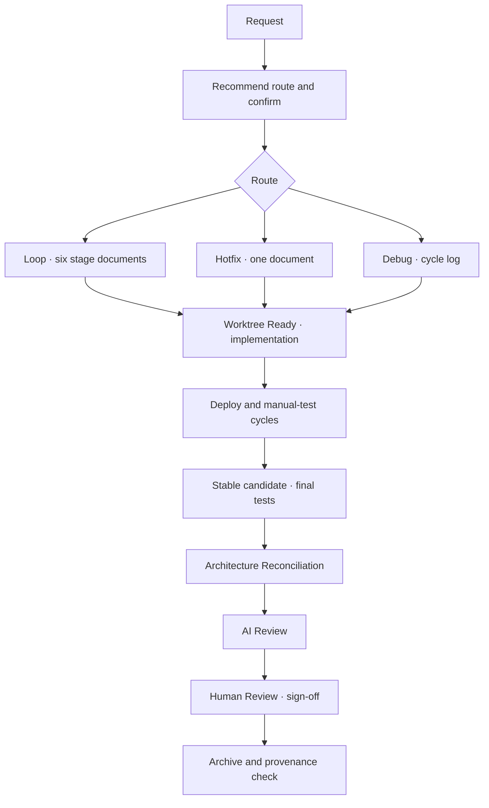

# sdd-loop

**A file-based workflow for AI-assisted software delivery.** It helps an agent and a team agree on requirements, keep implementation evidence, and close a reviewed change without losing the decisions made along the way.

  

<a href="README.md">English</a> · <a href="README_zh.md">简体中文</a>

## Choose the work

| Route | Use it for | What happens |
|---|---|---|
| **Loop** | A feature or planned change | A 7-station interview shapes `requirements.md`, `architecture.md`, `specification.md`, and `tasks.md`; implementation and verification complete the six-document Loop. |
| **Hotfix** | A focused urgent repair | An independent, single-document change beside the ordinary Loop. |
| **Debug** | Repeated deploy → manual test → fix cycles | Brief notes for each cycle; final evidence and approval when the candidate is stable. |

For new governance v2 work, pi's `/sdd` command (or the `sdd-route` Skill on another host) **recommends** a route and explains why. A person confirms the route before it starts. Projects can replace each route's [workflow definition](workflows/loop/workflow.md); a stream can override the project definition. The selected definition and hash are locked at start, so later configuration edits do not change a run already in progress.

## How delivery moves


```mermaid
flowchart TD
    A[Request] --> B[Recommend route and confirm]
    B --> C{Route}
    C --> L[Loop · six stage documents]
    C --> HF[Hotfix · one document]
    C --> T[Debug · cycle log]
    L --> D[Worktree Ready · implementation]
    HF --> D
    T --> D
    D --> E[Deploy and manual-test cycles]
    E --> F[Stable candidate · final tests]
    F --> G[Architecture Reconciliation]
    G --> REV[AI Review]
    REV --> I[Human Review · sign-off]
    I --> J[Archive and provenance check]
```

The diagram shows a typical v2 sequence; each route's locked dependency graph controls the exact order. The Loop keeps six stage documents: `requirements.md`, `architecture.md`, `specification.md`, `tasks.md`, `implementation.md`, and `verification.md`. Requirements need explicit approval. Split repositories use a separate branch and worktree per `stream + Loop`. Under governance v1, each stage approval stops at `awaiting_continue` until a later user message continues it; worktree-local `audit/*.jsonl` shards preserve the hash-chained record.

Under **governance v2**, manual testing adds short records of the issue, fix scope, focused test, deployment, and retest. New product decisions are confirmed when made. After the candidate stabilizes, only affected document clauses and downstream evidence are revisited. Final verification records applicable Testing, PBT, Security, and Resiliency evidence; PBT evidence includes a deterministic `seed` when relevant. Architecture reconciliation and Review attach to that candidate. Before AI Review, a **human choice** selects a read-only `subagent` or a named Agent with a `handoff`. Review outcomes include `READY_FOR_HUMAN_REVIEW`, `CHANGES_REQUIRED`, and `NOT_REVIEWABLE_SAFELY`.

The workflow definition decides whether Review is required or waived and whether sign-off comes from the submitter, a named role, is optional, or is waived. Source receipts use the actual changed files: unrelated sibling-stream edits do not invalidate this run; a shared-file edit needs focused tests and a delta Review. A closed run retains its historical receipt, so later changes to the same file belong to later deliveries. `sdd-loop provenance` checks that a commit range has an attributable delivery receipt.

## Installation

Requires Node ≥ 20. Install the CLI and eight Skills:

```bash
git clone https://github.com/Roger0808/sdd-loop.git && cd sdd-loop
npm install
npm link
sdd-loop init -g
```

If the CLI is already installed, install only the Skills with `npx skills@latest add Roger0808/sdd-loop -g`. Restart the agent or open a new session after installation.

Check that the current host has the resources for the governance version your project uses:

```bash
sdd-loop capabilities --require governance@2 --host agents
sdd-loop capabilities --require governance@1 --host agents
```

Choose `--host` from `claude`, `agents`, `openclaw`, `hermes`, or `pi`:

| Target | Installation |
|---|---|
| Claude Code | `~/.claude/skills/` |
| Agent Skills | `~/.agents/skills/` for Codex, Gemini CLI, GitHub Copilot, Cursor, Windsurf, OpenCode, Kimi Code, Antigravity, Factory Droid, and Roo Code |
| OpenClaw | Shared location by default; `OPENCLAW_STATE_DIR` selects a custom state directory |
| Hermes Agent | Skills configuration |
| pi | Package registration |

Limit `init -g` with `--claude`, `--agents`, `--openclaw`, `--hermes`, or `--pi`; `--show` previews the plan. Existing files are never overwritten.

### First use

In a new repository, ask the agent for `/sdd init` (`sdd-init`), then describe the work with `/sdd`. To inspect a route before confirming it:

```bash
sdd-loop workflow recommend --request-file /tmp/request.txt --repo .
sdd-loop workflow show --route loop --repo .
```

For a v2 run, set `governanceVersion: 2` in the project status file and confirm the recommended route. The agent then uses `sdd-loop workflow start`, `sdd-loop workflow record`, and `sdd-loop workflow close`; `close` moves the run into the locked archive directory and returns its new path. The CLI reads confirmation and event JSON from files so those inputs do not enter shell history.

## Skills and commands

| Ask for | Skill | Purpose |
|---|---|---|
| `/sdd init` | [`sdd-init`](skills/sdd-init) | Set up repository rules and status. |
| `/sdd` | [`sdd-interview`](skills/sdd-interview), [`sdd-route`](skills/sdd-route) | Start or continue a Loop; recommend a v2 route and wait for confirmation. |
| `/sdd upgrade` | [`sdd-upgrade`](skills/sdd-upgrade) | Align an existing project's rules or split streams. |
| `/sdd review` | [`sdd-review`](skills/sdd-review) | Reconcile the Architecture Baseline, prepare the AI Review and Human Review packet. |
| `/sdd-hotfix` | [`sdd-hotfix`](skills/sdd-hotfix) | Run an independent urgent fix; pi also accepts `/sdd hotfix`. |
| `/sdd-debug` | [`sdd-debug`](skills/sdd-debug) | Repeat manual testing and repairs; pi also accepts `/sdd debug`. |
| `/sdd-full-test` | [`sdd-full-test`](skills/sdd-full-test) | Collect a verifiable test evidence bundle; pi also accepts `/sdd full-test`. |

The CLI supplies six user commands:

| Command | Purpose |
|---|---|
| `sdd-loop check --repo <dir> [--stream <name>]` | Read-only comparison of status declarations and repository facts; exit `0` clean, `1` inconsistent, `2` unreadable. |
| `sdd-loop guide --type specification.entity-table` | Clause guidance, existing ID families, and a repository example before writing. |
| `sdd-loop capabilities --require governance@2 --host agents` | Verify CLI, rules, and installed host Skills. Other capabilities include `hotfix@1`, `debug@1`, and `full-test@1`. |
| `sdd-loop workflow` (`recommend`, `show`, `start`, `record`, `close`) | Recommend a route, inspect its graph, then record a confirmed v2 run. |
| `sdd-loop provenance check --base <base> --head <head>` | Classify changed files as `covered`, `drifted`, `unattributed`, or `ambiguous`; a delivery gate requires coverage. |
| `sdd-loop init -g` | Install Skills and host integration; it does not initialize a project. |

## Configuration and existing projects

- Built-in definitions: [Loop](workflows/loop/workflow.md), [Hotfix](workflows/hotfix/workflow.md), [Debug](workflows/debug/workflow.md). Replace one completely at `docs/sdd/workflows/<route>/workflow.md`; a stream-specific `docs/sdd/workflows/<stream>/<route>/workflow.md` takes precedence. The validated dependency graph can put deployment before manual testing and final verification.
- New work uses `governanceVersion: 2`. An active v1 run keeps its original stage and signature rules. `legacy_scope_reconciled` provides a targeted scope, test, and delta Review path for an active split-stream v1 Loop. For an old closed Loop whose Review source cannot be reconstructed, `legacy_baseline_established` records a one-time forward baseline and the limits of its historical evidence. Neither event invents an earlier approval.
- An older CLI reports `governanceVersion: 2` as unsupported. Updating a project's rules with `sdd-upgrade` does not update the installed CLI or Skills: project rules **never auto-update tools**.
- `AGENTS.md` remains the repository's gate. With an existing file, init or upgrade prepares a candidate and itemized audit instead of replacing it. Decisions such as `KEEP_SDD_CANONICAL` and `NOT_TESTABLE_SAFELY` are explained in [sdd-upgrade](skills/sdd-upgrade/SKILL.md).

To update a full installation:

```bash
git pull --ff-only
npm install
npm link
sdd-loop init -g
```

For a Skills-only installation, run `npx skills@latest update -g`. See the individual [Skills](skills/sdd-init) and [project architecture](CLAUDE.md) for the full gate and evidence contracts.

## License

MIT — [LICENSE](LICENSE).
