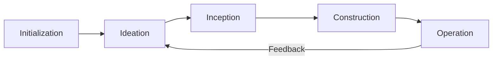

# sdd-loop

**From an idea to a reviewed delivery, with decisions kept in the repository.** sdd-loop gives AI agents and people a shared path through planning, implementation, testing, and approval.

  

<a href="README.md">English</a> · <a href="README_zh.md">简体中文</a>

## The AI-DLC lifecycle

[AWS AI-DLC](https://awslabs.github.io/aidlc-workflows/guide/04-phases-and-stages/) describes five phases and a feedback loop. The stages included in a particular run depend on its scope:


```mermaid
flowchart LR
    A[Initialization] --> B[Ideation]
    B --> C[Inception]
    C --> D[Construction]
    D --> E[Operation]
    E -->|Feedback| B
```

| Phase | Main question |
|---|---|
| **Initialization** | Is the workspace and its state ready? |
| **Ideation** | What is the intent, scope, and reason to proceed? |
| **Inception** | What requirements, design, work units, and delivery plan will guide the build? |
| **Construction** | Can the solution be built and tested in reviewable pieces? |
| **Operation** | Can it be deployed, observed, supported, and improved from feedback? |

AI-DLC checks artifact consistency and traceability at phase boundaries before downstream work proceeds. People approve the decisions that need judgment.

sdd-loop applies this intent-to-feedback path to repository work. It offers three routes, so a feature, urgent fix, and manual-testing session can each follow a fitting workflow.

## Choose a workflow

| Route | Use it for | Path |
|---|---|---|
| **Loop** | A feature or planned change | A 7-station interview produces `requirements.md`, `architecture.md`, `specification.md`, and `tasks.md`; implementation and verification complete the six-document Loop. |
| **Hotfix** | A focused urgent repair | One independent repair document, followed by validation and acceptance. |
| **Debug** | Repeated deployment and manual testing | Diagnose, fix, deploy, and retest until the result is ready for closeout. |

Describe the task to pi's `/sdd` command or the `sdd-route` Skill on another host. It recommends a route with a reason; **you confirm the choice** before work starts. The project can choose the order of deployment, manual testing, verification, and review in its [workflow definition](workflows/loop/workflow.md).

A Loop starts with a confirmed need, moves through design and implementation in an isolated worktree, then collects test and deployment evidence. The team reviews a stable candidate: AI Review examines the code, and Human Review records the acceptance decision. Feedback can start another Loop, Hotfix, or Debug session. The six stage documents are `requirements.md`, `architecture.md`, `specification.md`, `tasks.md`, `implementation.md`, and `verification.md`.

## Installation

Requires Node ≥ 20. Install the CLI and eight Skills:

```bash
git clone https://github.com/Roger0808/sdd-loop.git && cd sdd-loop
npm install
npm link
sdd-loop init -g
```

If the CLI is already installed, install only the Skills with `npx skills@latest add Roger0808/sdd-loop -g`. Restart the agent or open a new session after installation.

Check that the current host has the workflow resources:

```bash
sdd-loop capabilities --require governance@2 --host agents
```

Choose `--host` from `claude`, `agents`, `openclaw`, `hermes`, or `pi`:

| Target | Installation |
|---|---|
| Claude Code | `~/.claude/skills/` |
| Agent Skills | `~/.agents/skills/` for Codex, Gemini CLI, GitHub Copilot, Cursor, Windsurf, OpenCode, Kimi Code, Antigravity, Factory Droid, and Roo Code |
| OpenClaw | Shared location by default; `OPENCLAW_STATE_DIR` selects a custom state directory |
| Hermes Agent | Skills configuration |
| pi | Package registration |

Limit `init -g` with `--claude`, `--agents`, `--openclaw`, `--hermes`, or `--pi`; `--show` previews the plan. Existing files are never overwritten.

### First use

In a new repository, ask the agent for `/sdd init` (`sdd-init`), then describe the work with `/sdd`. To inspect a route before confirming it:

```bash
sdd-loop workflow recommend --request-file /tmp/request.txt --repo .
sdd-loop workflow show --route loop --repo .
```

Once you confirm a route, the agent starts and tracks the work. Project setup for configurable routes is described in [`sdd-route`](skills/sdd-route/SKILL.md).

## Skills and commands

| Ask for | Skill | Purpose |
|---|---|---|
| `/sdd init` | [`sdd-init`](skills/sdd-init) | Set up repository rules and status. |
| `/sdd` | [`sdd-interview`](skills/sdd-interview), [`sdd-route`](skills/sdd-route) | Start or continue work; recommend a route and wait for confirmation. |
| `/sdd upgrade` | [`sdd-upgrade`](skills/sdd-upgrade) | Align an existing project's rules or split streams. |
| `/sdd review` | [`sdd-review`](skills/sdd-review) | Reconcile the Architecture Baseline, prepare the AI Review and Human Review packet. |
| `/sdd-hotfix` | [`sdd-hotfix`](skills/sdd-hotfix) | Run an independent urgent fix; pi also accepts `/sdd hotfix`. |
| `/sdd-debug` | [`sdd-debug`](skills/sdd-debug) | Repeat manual testing and repairs; pi also accepts `/sdd debug`. |
| `/sdd-full-test` | [`sdd-full-test`](skills/sdd-full-test) | Collect a verifiable test evidence bundle; pi also accepts `/sdd full-test`. |

The CLI supplies six user commands:

| Command | Purpose |
|---|---|
| `sdd-loop check --repo <dir> [--stream <name>]` | Read-only comparison of status declarations and repository facts; exit `0` clean, `1` inconsistent, `2` unreadable. |
| `sdd-loop guide --type specification.entity-table` | Clause guidance, existing ID families, and a repository example before writing. |
| `sdd-loop capabilities --require governance@2 --host agents` | Verify CLI, rules, and installed host Skills. |
| `sdd-loop workflow` (`recommend`, `show`, `start`, `record`, `close`) | Recommend a route, inspect its graph, and track confirmed work. |
| `sdd-loop provenance check --base <base> --head <head>` | Check whether delivered code changes have matching review evidence. |
| `sdd-loop init -g` | Install Skills and host integration; it does not initialize a project. |

## Make it fit your project

Start from the [Loop](workflows/loop/workflow.md), [Hotfix](workflows/hotfix/workflow.md), or [Debug](workflows/debug/workflow.md) workflow. A project can replace a route at `docs/sdd/workflows/<route>/workflow.md`; a stream can provide its own definition at `docs/sdd/workflows/<stream>/<route>/workflow.md`. Each definition sets stage dependencies, Review policy, and who signs. A route already in progress keeps the definition chosen at its start.

`AGENTS.md` holds project rules. For an existing repository, `/sdd upgrade` prepares proposed rule changes for human review. It updates project conventions; installed tools are updated separately. Full governance contracts live in the [Skills](skills/sdd-init) and [maintainer architecture](CLAUDE.md).

To update a full installation:

```bash
git pull --ff-only
npm install
npm link
sdd-loop init -g
```

For a Skills-only installation, run `npx skills@latest update -g`.

## License

MIT — [LICENSE](LICENSE).
