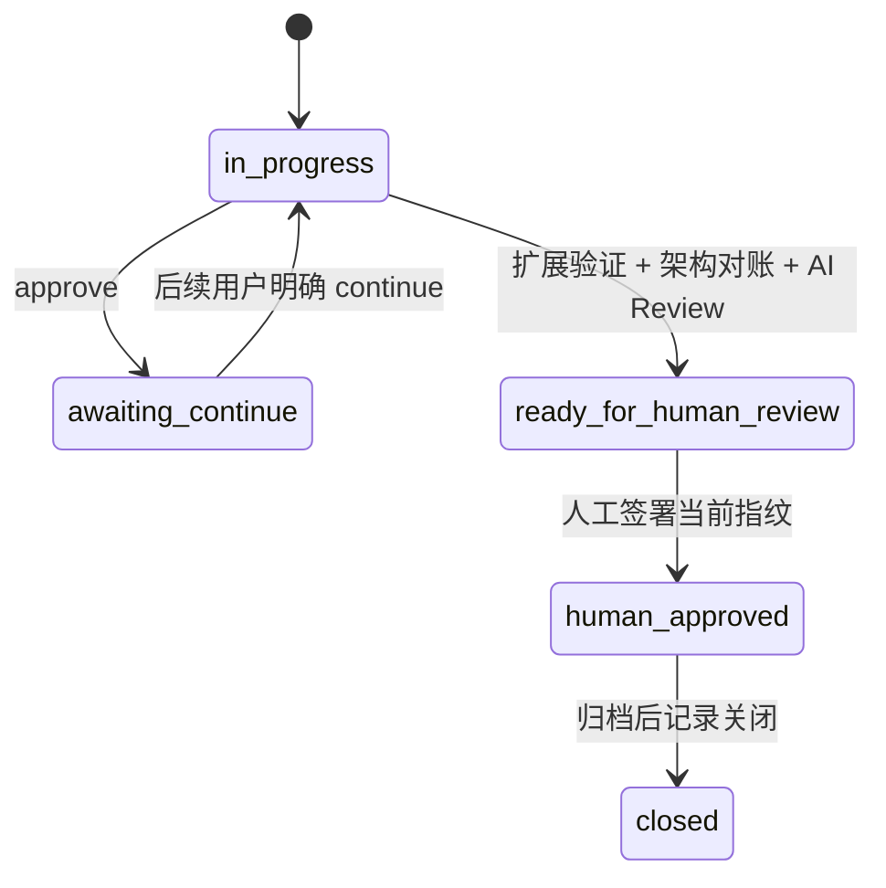
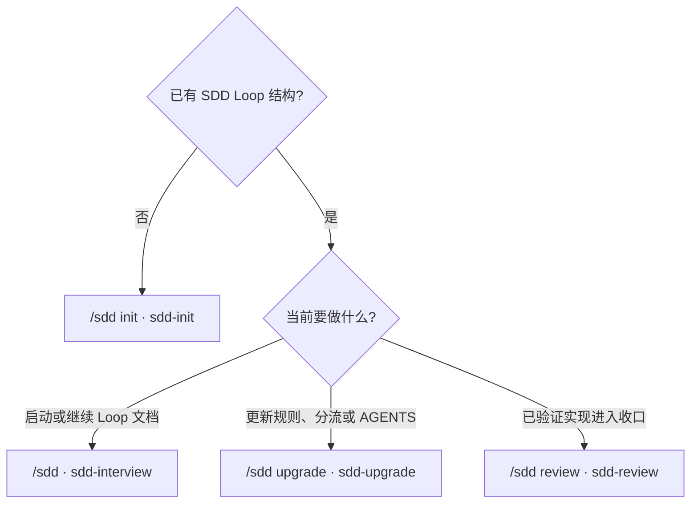

<h1 align="center">sdd-loop</h1>

<p align="center">
  <strong>面向 AI 协作交付的可重复、可审计 SDD 生命周期</strong>
</p>

<p align="center">
  <a href="LICENSE"></a>
  = 20">
  
</p>

<p align="center">
  <a href="#工作流程">工作流程</a> &bull;
  <a href="#安装">安装</a> &bull;
  <a href="#命令">命令</a> &bull;
  <a href="#仓库结构">仓库结构</a>
</p>

<p align="center">
  <a href="README.md">English</a> &bull;
  <a href="README_zh.md">简体中文</a>
</p>

---

一句话需求 → 七站访谈 → 分阶段审批 → 隔离实施 → 工程验证 → 架构对账 → AI 审查 → 人工确认。完整走一遍就是一个 **Loop**。

## 工作流程

```mermaid
flowchart LR
    R[Requirements] --> G1[Approve → 停止 → 后续 Continue]
    G1 --> A[Architecture]
    A --> G2[Approve → 停止 → 后续 Continue]
    G2 --> S[Specification]
    S --> G3[Approve → 停止 → 后续 Continue]
    G3 --> T[Tasks]
    T --> G4[Approve → 停止 → 后续 Continue]
    G4 --> W[Worktree Ready]
    W --> I[Implementation]
    I --> G5[Approve → 停止 → 后续 Continue]
    G5 --> E[自动验证 + 工程扩展]
    E --> B[Architecture Reconciliation]
    B --> AI[AI Review]
    AI --> H[Human Review]
    H --> X[Closed]
```



原有六份阶段文档和 `nextPhase` 取值不变，新增名称都是门禁：

| 门禁 | 必须具备的证据 |
|---|---|
| Requirements | `requirements.md` 已由用户明确确认 |
| Architecture/Baseline | 本轮 `architecture.md` 已确认，长期 Architecture Baseline 与系统现状一致 |
| Specification | `specification.md` 已定义可验证行为 |
| Tasks | `tasks.md` 的每项任务都能追溯到已确认条款 |
| Worktree Ready | 分流项目已为当前 stream + Loop 建立独立分支和 Git worktree |
| Implementation | `implementation.md` 已记录基线分支、基线 commit、当前分支和任务范围 |
| Automated Verification | 已记录测试、构建、部署检查和未执行项 |
| Architecture Reconciliation | 最终代码已反向更新长期架构，并生成 change surface |
| AI Review | 只读 reviewer 已给出一个固定结论 |
| Human Review | 人工明确通过当前审查指纹 |
| Closed | 阶段文档归档，并同步更新状态文件 |

### 审批、角色与审计



| 机制 | 规则 |
|---|---|
| 角色 | Requester、Product、Architect、Implementer、Reviewer、Approver 映射到 Git 邮箱 |
| Approve | 确认当前阶段并进入 `awaiting-continue`，不推进 `nextPhase` |
| Continue | 必须来自后续用户消息；重新校验角色和文档指纹 |
| 审计 | 每个 worktree 向自己的 `audit/*.jsonl` 分片追加事件，哈希链防篡改 |
| 隐私 | Token、密码和私钥脱敏；不记录本机 worktree 绝对路径或完整 AI 输出 |
| 失效 | 审批后文档变化使审批失效；Review 后代码或关键文档变化使签署失效 |

### 工程质量扩展

四项默认启用；每轮都必须写 `PASS`、`FAIL` 或有理由的 `N/A`：

| 扩展 | 何时使用 | PASS 证据 |
|---|---|---|
| Testing | 所有存在可执行行为的改动 | 验收条件映射、命令、退出码、结果和未覆盖范围 |
| PBT | Parser、业务规则、状态机、权限、幂等、排序、分页、并发 | Property、输入域、case 数、seed 和回归反例 |
| Security | 输入、身份、权限、租户、Secrets、依赖或网络边界变化 | 信任边界、负向测试、检查结果和剩余风险 |
| Resiliency | 外部依赖、重试、事务、部署或运行时变化 | 故障场景、超时/重试/幂等、回滚和观测证据 |

没有 PBT 库时：`现有库 → 现有测试框架 + 确定性 seed 生成器 → 获批后新增依赖`。没有库本身不是 `N/A` 理由；只有不存在有价值的不变量时才可写明理由后跳过。

### Worktree 隔离

- 分流项目每个 `stream + Loop` 使用独立分支和 worktree。
- 主工作区只用于同步、集成和审查。
- 跨系统或平台级改动使用独立的 platform worktree。
- 已在主工作区实施的存量 Loop 可记录一次性豁免；下一个 Loop 不得继承。

### 架构与审查

- 本轮 `architecture.md` 描述本轮方案；`docs/architecture/` 描述系统当前事实。
- 优先沿用已有架构目录；没有时，单系统用 `docs/architecture/overview.md`，分流项目用 `docs/architecture/<stream>.md`。架构图使用 Mermaid 或 ASCII。
- 自动化验证后，按最终代码更新 Architecture Baseline，并列出代码、配置、数据、接口、部署、测试和文档改动面。
- 随后进行独立、只读的 AI 审查。结论只能是 `READY_FOR_HUMAN_REVIEW`、`CHANGES_REQUIRED` 或 `NOT_REVIEWABLE_SAFELY`。
- `verification.md` 固定包含 `Automated Verification`、`Architecture Reconciliation & Change Surface`、`AI Code Review` 和 `Human Review Packet`。
- 代码或关键文档变化会使旧审查失效。只有人工记录确认人、时间、审查版本和指纹后才能关闭 Loop。

## AGENTS.md 处理

- 没有 AGENTS.md：sdd-init 按单流/分流和项目事实筛选规则，直接生成结构化最终版本。
- 已有 AGENTS.md：sdd-init 或 sdd-upgrade 只在 `/tmp` 生成 `AGENTS.candidate.md` 和逐项报告，不静默覆盖仓库文件。
- 删除、移动和合并必须逐项授权；模型、权限、MCP 和宿主配置不在审计范围内。

分类：`KEEP_SDD_CANONICAL`、`KEEP_PROJECT_SPECIFIC`、`DUPLICATED`、`STALE`、`MODEL_OR_HOST_SPECIFIC`、`BELONGS_IN_AGENT_CONFIG`、`CANONICAL_ELSEWHERE`、`UNCLEAR`。

审计结论：`RECOMMEND_ADOPTION`、`NEEDS_REVISION`、`KEEP_CURRENT`、`NOT_TESTABLE_SAFELY`。

## 安装

要求 Node ≥ 20。

**完整安装：四个 Skill + `capabilities` / `check` / `guide` CLI**

```bash
git clone https://github.com/Roger0808/sdd-loop.git && cd sdd-loop
npm install
npm link
sdd-loop init -g
```

**只安装 Skill：适用于已经安装 CLI 的环境**

```bash
npx skills@latest add Roger0808/sdd-loop -g
```

| 落点 | 安装方式 |
|---|---|
| 内置 Skill | [sdd-init](skills/sdd-init)、[sdd-interview](skills/sdd-interview)、[sdd-upgrade](skills/sdd-upgrade)、[sdd-review](skills/sdd-review) |
| Claude Code | `~/.claude/skills/` |
| Agent Skills 宿主 | `~/.agents/skills/` — Codex、Gemini CLI、GitHub Copilot、Cursor、Windsurf、OpenCode、OpenClaw、Kimi Code、Antigravity、Factory Droid、Roo Code |
| Hermes Agent | 通过其 Skills 配置登记 |
| pi | 登记本包 |

| 选项 | 效果 |
|---|---|
| `--claude` / `--agents` / `--openclaw` / `--hermes` / `--pi` | 只安装到指定宿主 |
| `--show` | 只预览，不写入 |
| OpenClaw 默认 state | `sdd-loop init -g --openclaw` → `~/.agents/skills/` |
| 自定义 `OPENCLAW_STATE_DIR` | `sdd-loop init -g --openclaw` → `$OPENCLAW_STATE_DIR/skills/` |
| 已有同名文件或目录 | 报告冲突，不覆盖、不删除 |

### 更新

**完整安装**

```bash
cd <sdd-loop-dir>
git pull --ff-only
npm install
npm link
sdd-loop init -g
```

**只安装 Skill**

```bash
npx skills@latest update -g
```

| 更新动作 | 效果 |
|---|---|
| `git pull` | 更新 CLI 和软链指向的 Skill 内容 |
| `sdd-loop init -g` | 补充新 Skill 或宿主配置 |
| `npx skills@latest update -g` | 更新由 `npx skills` 管理的安装 |
| `sdd-upgrade` | 更新项目内的 SDD/AGENTS 规则，不更新本机安装包 |

安装后重启宿主或开启新会话。

```bash
sdd-loop capabilities --require governance@1 --host agents
```

治理项目开工前先运行。`--host` 取 `claude`、`agents`、`openclaw`、`hermes` 或 `pi`；Codex、Kimi Code 等读取共享 Agent Skills 的宿主使用 `agents`。命令不存在或退出非 0，表示 CLI/规则资源不完整，或当前宿主尚未安装 Skills；项目规则不会自动更新工具。

## 命令

| CLI | 用途 |
|---|---|
| `sdd-loop capabilities --require governance@1 --host <宿主>` | Fail closed 检查 CLI、治理资源及当前宿主的 Skill 安装是否支持协议 1 |
| `sdd-loop check` | 对账状态声明与仓库事实 |
| `sdd-loop guide --type <doc.clause>` | 查询条款口径和现有编号族 |

### 四个工作流命令



| pi 命令 | Skill 名称 / 斜杠别名 | 什么时候用 | 产出 |
|---|---|---|---|
| `/sdd init` | `sdd-init` / `/sdd-init` | 仓库还没有 SDD Loop 结构 | 创建项目规则和初始状态，不写业务内容 |
| `/sdd` | `sdd-interview` / `/sdd-interview` | 启动产品或新一轮 Loop | 访谈并产出 `requirements.md`、`architecture.md`、`specification.md`、`tasks.md` |
| `/sdd upgrade` | `sdd-upgrade` / `/sdd-upgrade` | 已初始化仓库需要补新门禁、治理角色、分流或审计 AGENTS | 无损升级现有 SDD 约定，不伪造历史、不静默替换项目规则 |
| `/sdd review` | `sdd-review` / `/sdd-review` | Implementation 和自动化验证已经完成 | 架构对账、记录 change surface、AI 审查并准备人工审查包 |

pi 使用第一列；其他宿主调用 Skill 名称或斜杠别名。

### 状态对账

```bash
sdd-loop check
sdd-loop check --repo <dir>
sdd-loop check --stream <name>
sdd-loop check --json
```

| 退出码 | 含义 |
|---|---|
| `0` | 干净 |
| `1` | 声明与仓库事实矛盾 |
| `2` | 判据不可读，不给结论 |

启用 `governanceVersion: 1` 的项目还会检查审批/Continue、角色身份、审计哈希链、版本指纹、四项工程扩展和人工关闭门禁；旧项目仍保持原有检查结果与退出码。

### 条款口径

```bash
sdd-loop guide
sdd-loop guide --type specification.entity-table
```

在写条款前返回必填项、已有编号族和仓库内参考写法。pi 的未知 `/sdd` 子命令只返回用法。

## 仓库结构

```text
your-project/
├── AGENTS.md
├── CLAUDE.md
└── docs/
    ├── architecture/
    │   └── overview.md 或 <stream>.md
    ├── loops/
    │   └── [<stream>/]
    │       ├── status.md
    │       └── loop-N/
    │           ├── audit/
    │           │   └── <writer-id>.jsonl
    │           ├── requirements.md
    │           ├── architecture.md
    │           ├── specification.md
    │           ├── tasks.md
    │           ├── implementation.md
    │           └── verification.md
    ├── sdd/extensions/        # 可选项目扩展；*.opt-in.md 控制启用
    └── archive/
```

`sdd-loop check` 自动发现单流或分流结构；自定义路径使用 `--status-file` 和 `--archive-dir`。

## 许可

MIT License — 见 [LICENSE](LICENSE)。
