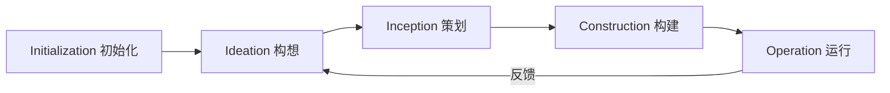

# sdd-loop

**从想法到审查通过的交付，把决定留在仓库里。** sdd-loop 为人和 AI Agent 提供共同的规划、实施、测试与验收路径。

  

<a href="README.md">English</a> · <a href="README_zh.md">简体中文</a>

## AI-DLC 的流程

[AWS AI-DLC](https://awslabs.github.io/aidlc-workflows/guide/04-phases-and-stages/) 将开发生命周期分为五个阶段，并让运行反馈进入下一轮；每次实际执行的阶段由工作范围决定：


```mermaid
flowchart LR
    A[Initialization 初始化] --> B[Ideation 构想]
    B --> C[Inception 策划]
    C --> D[Construction 构建]
    D --> E[Operation 运行]
    E -->|反馈| B
```

| 阶段 | 要回答的问题 |
|---|---|
| **Initialization 初始化** | 工作区和流程状态准备好了吗？ |
| **Ideation 构想** | 要解决什么问题，范围和目标是什么，是否值得继续？ |
| **Inception 策划** | 需求、设计、工作拆分与交付计划是什么？ |
| **Construction 构建** | 能否分步实现、测试并审查？ |
| **Operation 运行** | 能否部署、观测、维护，并从反馈中改进？ |

进入下一阶段前，AI-DLC 会核查产物的一致性和可追溯关系；需要判断的决定仍由人确认。

sdd-loop 将这条“意图到反馈”的主线用于仓库交付，并提供三种流程，让功能开发、紧急修复和连续手测分别走适合的路径。

## 选择工作流程

| 流程 | 适用场景 | 路径 |
|---|---|---|
| **Loop** | 新功能或计划内改动 | 七站访谈形成 `requirements.md`、`architecture.md`、`specification.md`、`tasks.md`；实施与验证后组成六份阶段文档。 |
| **Hotfix** | 范围明确的紧急修复 | 一份独立修复文档，随后验证和验收。 |
| **Debug** | 反复部署与人工测试 | 排查、修复、部署和复测，直到可以收口。 |

向 pi 的 `/sdd` 命令或其他宿主的 `sdd-route` Skill 描述任务。它会说明推荐哪条流程及理由；**你确认后才启动**。项目可在 [workflow 定义](workflows/loop/workflow.md) 中安排部署、人工测试、验证和审查的顺序。

一轮 Loop 从明确的需求开始，经过设计和独立 worktree 中的实施，再收集测试与部署证据。候选版本稳定后，AI Review 审查代码，Human Review 记录验收决定。反馈可以开启下一轮 Loop、Hotfix 或 Debug。六份阶段文档是 `requirements.md`、`architecture.md`、`specification.md`、`tasks.md`、`implementation.md`、`verification.md`。

## 安装

要求 Node ≥ 20。安装 CLI 和八个 Skill：

```bash
git clone https://github.com/Roger0808/sdd-loop.git && cd sdd-loop
npm install
npm link
sdd-loop init -g
```

如果已安装 CLI，只安装 Skill：`npx skills@latest add Roger0808/sdd-loop -g`。安装后重启 Agent 或开启新会话。

检查当前宿主是否装齐流程资源：

```bash
sdd-loop capabilities --require governance@2 --host agents
```

`--host` 可选 `claude`、`agents`、`openclaw`、`hermes`、`pi`：

| 宿主 | 安装落点 |
|---|---|
| Claude Code | `~/.claude/skills/` |
| Agent Skills | `~/.agents/skills/`，供 Codex、Gemini CLI、GitHub Copilot、Cursor、Windsurf、OpenCode、Kimi Code、Antigravity、Factory Droid、Roo Code 使用 |
| OpenClaw | 默认使用共享目录；`OPENCLAW_STATE_DIR` 可指定独立 state |
| Hermes Agent | Skills 配置 |
| pi | 登记本包 |

`init -g` 可用 `--claude`、`--agents`、`--openclaw`、`--hermes`、`--pi` 限定落点，`--show` 只预览；已有文件不会被覆盖。

### 第一次使用

新仓库先让 Agent 执行 `/sdd init`（`sdd-init`），然后用 `/sdd` 描述工作。确认前可查看流程推荐和定义：

```bash
sdd-loop workflow recommend --request-file /tmp/request.txt --repo .
sdd-loop workflow show --route loop --repo .
```

你确认流程后，Agent 会启动并跟踪工作。可配置流程的项目设置见 [`sdd-route`](skills/sdd-route/SKILL.md)。

## Skill 与命令

| 对 Agent 说 | Skill | 用途 |
|---|---|---|
| `/sdd init` | [`sdd-init`](skills/sdd-init) | 建立项目规则和状态入口。 |
| `/sdd` | [`sdd-interview`](skills/sdd-interview)、[`sdd-route`](skills/sdd-route) | 启动或继续工作；推荐流程并等待确认。 |
| `/sdd upgrade` | [`sdd-upgrade`](skills/sdd-upgrade) | 对齐已有项目规则或迁移为分流。 |
| `/sdd review` | [`sdd-review`](skills/sdd-review) | 更新 Architecture Baseline，准备 AI Review 与 Human Review 材料。 |
| `/sdd-hotfix` | [`sdd-hotfix`](skills/sdd-hotfix) | 独立紧急修复；pi 也支持 `/sdd hotfix`。 |
| `/sdd-debug` | [`sdd-debug`](skills/sdd-debug) | 反复手测与修复；pi 也支持 `/sdd debug`。 |
| `/sdd-full-test` | [`sdd-full-test`](skills/sdd-full-test) | 采集可校验的测试证据包；pi 也支持 `/sdd full-test`。 |

CLI 提供六个用户命令：

| 命令 | 用途 |
|---|---|
| `sdd-loop check --repo <目录> [--stream <流>]` | 只读对账状态与仓库事实；退出 `0` 为一致、`1` 为矛盾、`2` 为证据不可读。 |
| `sdd-loop guide --type specification.entity-table` | 写条款前查看要求、现有编号族和仓库示例。 |
| `sdd-loop capabilities --require governance@2 --host agents` | 检查 CLI、规则和宿主 Skill。 |
| `sdd-loop workflow`（`recommend`、`show`、`start`、`record`、`close`） | 推荐流程、查看依赖图并跟踪已确认的工作。 |
| `sdd-loop provenance check --base <起点> --head <终点>` | 检查交付代码是否有对应的审查证据。 |
| `sdd-loop init -g` | 安装 Skill 与宿主集成；不会初始化项目仓库。 |

## 按项目调整

从 [Loop](workflows/loop/workflow.md)、[Hotfix](workflows/hotfix/workflow.md) 或 [Debug](workflows/debug/workflow.md) 的流程定义开始。项目可在 `docs/sdd/workflows/<route>/workflow.md` 完整覆盖，流也可在 `docs/sdd/workflows/<stream>/<route>/workflow.md` 定义自己的流程。定义中安排阶段依赖、Review 策略和签署者；已启动的工作沿用启动时的定义。

`AGENTS.md` 保存项目规则。已有仓库使用 `/sdd upgrade` 时，Agent 会提交规则候选供人工审阅。它更新项目约定；本机工具另行更新。完整治理约定见各 [Skill](skills/sdd-init) 和[维护者架构说明](CLAUDE.md)。

完整安装的更新方式：

```bash
git pull --ff-only
npm install
npm link
sdd-loop init -g
```

仅安装 Skill 的环境运行 `npx skills@latest update -g`。

## 许可

MIT — [LICENSE](LICENSE)。
