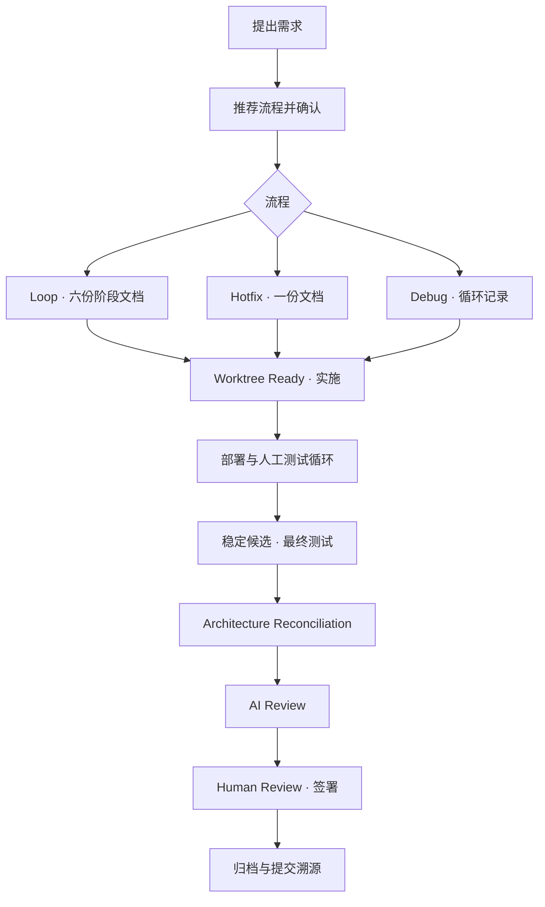

# sdd-loop

**用仓库文件管理 AI 协作开发流程。** 从需求确认、实施记录到代码审查和交付归档，让每一步都有可追溯的依据。

  

<a href="README.md">English</a> · <a href="README_zh.md">简体中文</a>

## 先选工作类型

| 流程 | 适用场景 | 主要产物 |
|---|---|---|
| **Loop** | 新功能或计划内改动 | 七站访谈形成 `requirements.md`、`architecture.md`、`specification.md`、`tasks.md`；实施与验证后组成六份阶段文档。 |
| **Hotfix** | 范围明确的紧急修复 | 与普通 Loop 并行的一份独立修复文档。 |
| **Debug** | 反复部署、人工测试和修复 | 每轮简记事实，版本稳定后再集中验证和验收。 |

新治理 v2 工作由 pi 的 `/sdd` 命令（其他宿主使用 `sdd-route` Skill）**推荐** Loop、Hotfix 或 Debug，并说明理由；用户确认后才启动。项目和流都能完整覆盖各自的 [workflow 定义](workflows/loop/workflow.md)。启动时固定所选定义与摘要，后续修改配置不会改变进行中的工作。

## 交付怎样推进


```mermaid
flowchart TD
    A[提出需求] --> B[推荐流程并确认]
    B --> C{流程}
    C --> L[Loop · 六份阶段文档]
    C --> HF[Hotfix · 一份文档]
    C --> T[Debug · 循环记录]
    L --> D[Worktree Ready · 实施]
    HF --> D
    T --> D
    D --> E[部署与人工测试循环]
    E --> F[稳定候选 · 最终测试]
    F --> G[Architecture Reconciliation]
    G --> REV[AI Review]
    REV --> I[Human Review · 签署]
    I --> J[归档与提交溯源]
```

图中是典型的 v2 顺序，实际顺序以启动时锁定的依赖图为准。普通 Loop 保留六份阶段文档：`requirements.md`、`architecture.md`、`specification.md`、`tasks.md`、`implementation.md`、`verification.md`。初始需求必须明确确认；分流仓库的每个 `stream + Loop` 使用独立分支和 worktree。治理 v1 的阶段审批停在 `awaiting_continue`，直到用户后续明确继续；每个 worktree 的 `audit/*.jsonl` 分片用哈希链保留过程记录。

**治理 v2** 在人工测试期间只记录问题、修复范围、定向测试、部署和复测结果。新的产品决定出现时当场确认；候选版本稳定后，只修订受影响的文档条款并重验下游证据。最终验证按需记录 Testing、PBT、Security、Resiliency 证据，适用 PBT 时保留确定性 `seed`；架构对账与 Review 绑定候选版本。AI Review 前由**人类选择**当前 Agent 的只读 `subagent`，或指定其他 Agent 并生成 `handoff`。审查结果包括 `READY_FOR_HUMAN_REVIEW`、`CHANGES_REQUIRED`、`NOT_REVIEWABLE_SAFELY`。

流程定义预先声明 Review 是否豁免，以及由提交者本人、指定角色签署、可选签署或免签。源码收据按实际变更文件建立：兄弟流无关改动不使本轮审查失效；共享文件的变更需定向测试和差量 Review。已关闭工作保留当时的源码收据，后续对同一文件的修改由后续交付负责。`sdd-loop provenance` 对提交区间核查交付归属。

## 安装

要求 Node ≥ 20。安装 CLI 和八个 Skill：

```bash
git clone https://github.com/Roger0808/sdd-loop.git && cd sdd-loop
npm install
npm link
sdd-loop init -g
```

如果已安装 CLI，只安装 Skill：`npx skills@latest add Roger0808/sdd-loop -g`。安装后重启 Agent 或开启新会话。

按项目使用的治理版本，检查当前宿主是否装齐能力：

```bash
sdd-loop capabilities --require governance@2 --host agents
sdd-loop capabilities --require governance@1 --host agents
```

`--host` 可选 `claude`、`agents`、`openclaw`、`hermes`、`pi`：

| 宿主 | 安装落点 |
|---|---|
| Claude Code | `~/.claude/skills/` |
| Agent Skills | `~/.agents/skills/`，供 Codex、Gemini CLI、GitHub Copilot、Cursor、Windsurf、OpenCode、Kimi Code、Antigravity、Factory Droid、Roo Code 使用 |
| OpenClaw | 默认使用共享目录；`OPENCLAW_STATE_DIR` 可指定独立 state |
| Hermes Agent | Skills 配置 |
| pi | 登记本包 |

`init -g` 可用 `--claude`、`--agents`、`--openclaw`、`--hermes`、`--pi` 限定落点，`--show` 只预览；已有文件不会被覆盖。

### 第一次使用

新仓库先让 Agent 执行 `/sdd init`（`sdd-init`），然后用 `/sdd` 描述工作。确认前可查看流程推荐和定义：

```bash
sdd-loop workflow recommend --request-file /tmp/request.txt --repo .
sdd-loop workflow show --route loop --repo .
```

启动 v2 工作前，在项目状态文件中配置 `governanceVersion: 2`，并确认推荐的流程。之后 Agent 使用 `sdd-loop workflow start`、`sdd-loop workflow record`、`sdd-loop workflow close`；`close` 把工作目录移入锁定的归档位置并返回新路径。确认原文和事件通过 JSON 文件传入 CLI，不进入 shell 历史。

## Skill 与命令

| 对 Agent 说 | Skill | 用途 |
|---|---|---|
| `/sdd init` | [`sdd-init`](skills/sdd-init) | 建立项目规则和状态入口。 |
| `/sdd` | [`sdd-interview`](skills/sdd-interview)、[`sdd-route`](skills/sdd-route) | 启动或继续 Loop；推荐 v2 流程并等待确认。 |
| `/sdd upgrade` | [`sdd-upgrade`](skills/sdd-upgrade) | 对齐已有项目规则或迁移为分流。 |
| `/sdd review` | [`sdd-review`](skills/sdd-review) | 更新 Architecture Baseline，准备 AI Review 与 Human Review 材料。 |
| `/sdd-hotfix` | [`sdd-hotfix`](skills/sdd-hotfix) | 独立紧急修复；pi 也支持 `/sdd hotfix`。 |
| `/sdd-debug` | [`sdd-debug`](skills/sdd-debug) | 反复手测与修复；pi 也支持 `/sdd debug`。 |
| `/sdd-full-test` | [`sdd-full-test`](skills/sdd-full-test) | 采集可校验的测试证据包；pi 也支持 `/sdd full-test`。 |

CLI 提供六个用户命令：

| 命令 | 用途 |
|---|---|
| `sdd-loop check --repo <目录> [--stream <流>]` | 只读对账状态与仓库事实；退出 `0` 为一致、`1` 为矛盾、`2` 为证据不可读。 |
| `sdd-loop guide --type specification.entity-table` | 写条款前查看要求、现有编号族和仓库示例。 |
| `sdd-loop capabilities --require governance@2 --host agents` | 检查 CLI、规则和宿主 Skill；另有 `hotfix@1`、`debug@1`、`full-test@1`。 |
| `sdd-loop workflow`（`recommend`、`show`、`start`、`record`、`close`） | 推荐流程、查看依赖图并记录用户确认的 v2 工作。 |
| `sdd-loop provenance check --base <起点> --head <终点>` | 将变更归为 `covered`、`drifted`、`unattributed` 或 `ambiguous`；交付门禁应要求全部有归属。 |
| `sdd-loop init -g` | 安装 Skill 与宿主集成；不会初始化项目仓库。 |

## 配置与旧项目

- 内置定义：[Loop](workflows/loop/workflow.md)、[Hotfix](workflows/hotfix/workflow.md)、[Debug](workflows/debug/workflow.md)。项目在 `docs/sdd/workflows/<route>/workflow.md` 完整覆盖；流级 `docs/sdd/workflows/<stream>/<route>/workflow.md` 优先。依赖图允许先部署、人工测试，再做最终验证。
- 新工作使用 `governanceVersion: 2`；进行中的 v1 工作保留原阶段和签署规则。分流 v1 Loop 可用 `legacy_scope_reconciled` 显式核对范围、定向测试和差量 Review。旧归档源码无法重建时，`legacy_baseline_established` 只建立一次向前基线并注明历史证据局限，不补造旧审批。
- 旧版 CLI 遇到 `governanceVersion: 2` 会报不支持。`sdd-upgrade` 更新的是项目规则，**不会自动更新工具**或本机 Skill。
- `AGENTS.md` 是项目门禁；已有文件时，初始化或升级只生成候选和逐项报告，不静默覆盖。`KEEP_SDD_CANONICAL`、`NOT_TESTABLE_SAFELY` 等分类详见 [sdd-upgrade](skills/sdd-upgrade/SKILL.md)。

完整安装的更新方式：

```bash
git pull --ff-only
npm install
npm link
sdd-loop init -g
```

仅安装 Skill 的环境运行 `npx skills@latest update -g`。完整门禁和证据约定见各 [Skill](skills/sdd-init) 与[项目架构](CLAUDE.md)。

## 许可

MIT — [LICENSE](LICENSE)。
